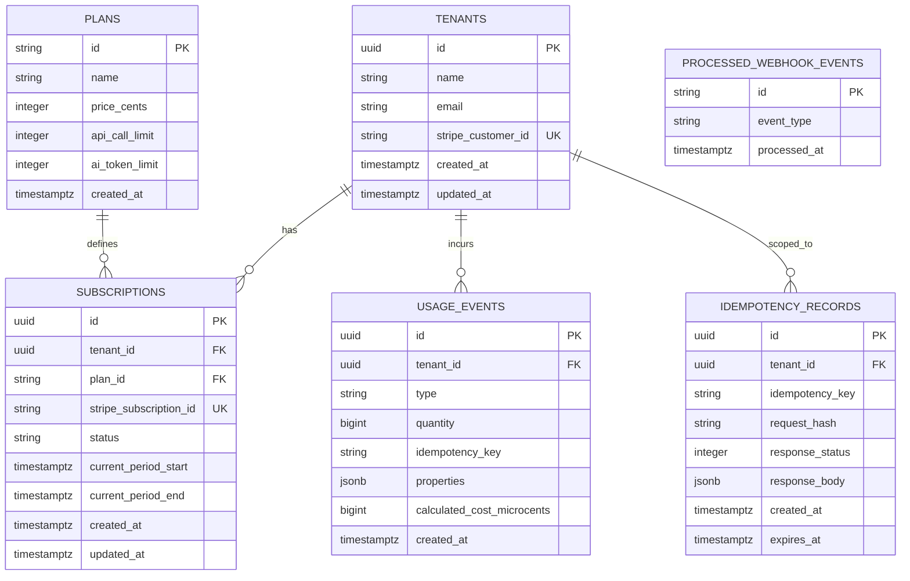
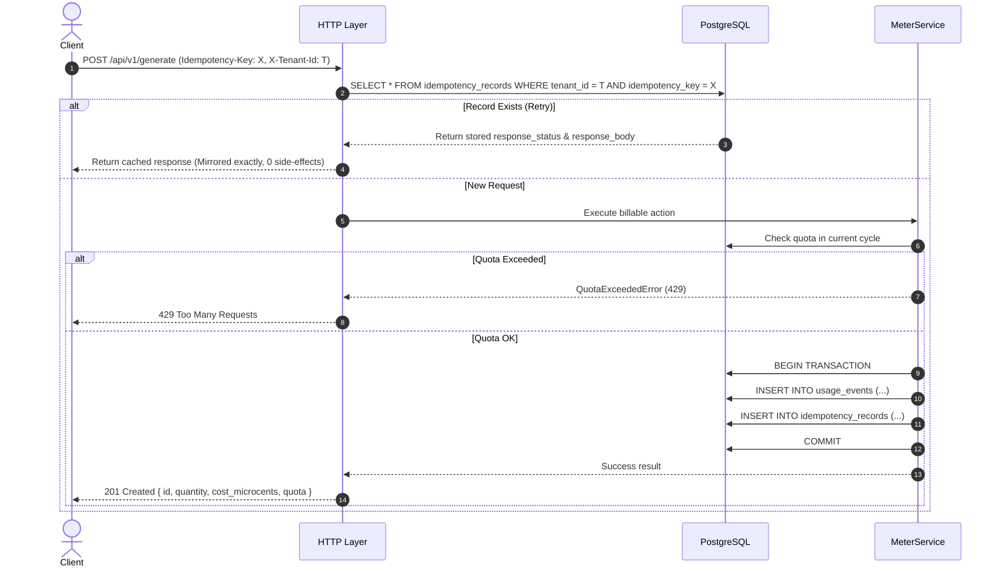

# System Design Document: Usage Metering & Billing Engine

**Author**: Antigravity & Engineering Team  
**Status**: Approved (Phase 1 Gate)  
**Target Stack**: Node.js + Express, PostgreSQL (via Docker), Stripe CLI (Test Mode)

---

## 1. Problem Statement & Mission

Every SaaS platform must reliably answer three fundamental questions:
1. **How much has this customer used?**
2. **Have they reached their plan limits?**
3. **How much do they owe?**

In distributed environments and real-world payment ecosystems, simple billing implementations routinely fail due to network retries that cause double-charging, webhook delivery replays, ambiguous boundary conditions at exact quota limits, and floating-point financial drift.

The mission of this engine is to build a lean, bulletproof backend service that guarantees:
- **Exactly-once usage metering** with end-to-end idempotency-key deduplication.
- **Strict and honest quota enforcement** with clear boundary semantics (`429 Too Many Requests` vs `402 Payment Required`).
- **Mathematically sound cost calculations** for API calls and AI tokens (including cached inputs and reasoning tokens) using strict integer money representation (microcents / cents).
- **Resilient Stripe subscription synchronization** via signature-verified, replay-resistant webhook handling in Stripe test mode.

---

## 2. Architecture & Layer Sketch

The service adheres to a strict layered architecture where HTTP transport, domain logic, and persistence are cleanly decoupled.

```
┌─────────────────────────────────────────────────────────────────────────────┐
│                           CLIENT / CONSUMERS                                │
│       (API Consumer, Background Worker, Stripe Test Webhook Events)         │
└──────────────────────────────────────┬──────────────────────────────────────┘
                                       │
                                       ▼
┌─────────────────────────────────────────────────────────────────────────────┐
│                         HTTP TRANSPORT & VALIDATION                         │
│  • Express Router & Middlewares (Auth / Tenant Resolver, Boundary Validation)│
│  • Idempotency Interceptor (Checks Idempotency-Key header)                  │
│  • Stripe Webhook Signature Verification (raw body validation)              │
└──────────────────────────────────────┬──────────────────────────────────────┘
                                       │
                                       ▼
┌─────────────────────────────────────────────────────────────────────────────┐
│                        DOMAIN / SERVICE LAYER                               │
│  ┌───────────────────────┐  ┌───────────────────────┐  ┌─────────────────┐  │
│  │     MeterService      │  │     QuotaService      │  │  BillingService │  │
│  │ (Record usage events, │  │ (Enforce limits, check│  │ (AI token math, │  │
│  │  idempotency caching) │  │  boundary honesty)    │  │  cost rollups)  │  │
│  └───────────────────────┘  └───────────────────────┘  └─────────────────┘  │
│  ┌───────────────────────────────────────────────────────────────────────┐  │
│  │                       StripeSyncService                               │  │
│  │         (Handle subscription lifecycle & deduplicate events)          │  │
│  └───────────────────────────────────────────────────────────────────────┘  │
└──────────────────────────────────────┬──────────────────────────────────────┘
                                       │
                                       ▼
┌─────────────────────────────────────────────────────────────────────────────┐
│                       PERSISTENCE LAYER (PostgreSQL)                        │
│  • Transactions (ACID isolation for usage record + idempotency store)       │
│  • Tenants, Plans, Subscriptions, UsageEvents, IdempotencyRecords, Events   │
└─────────────────────────────────────────────────────────────────────────────┘
```

### Layer Responsibilities
- **HTTP Transport Layer**: Parses incoming requests, validates input schemas (ensuring clean `4xx` responses and never unhandled `500`s), extracts headers (`X-Tenant-Id`, `Idempotency-Key`), and handles webhook cryptographic verification.
- **Domain / Service Layer**: Contains pure business rules for quota evaluations, pricing math, and state transitions. No raw SQL or Express request objects leak into this layer.
- **Persistence Layer**: Executes transactional queries, handles unique constraint conflict resolution, and persists usage and event history.

---

## 3. Database Schema & Data Model

The PostgreSQL schema enforces multi-tenant data isolation, strict relational integrity, and deduplication guarantees.



### Schema Specification (DDL)

```sql
-- Tenants table
CREATE TABLE tenants (
    id UUID PRIMARY KEY DEFAULT gen_random_uuid(),
    name VARCHAR(255) NOT NULL,
    email VARCHAR(255) NOT NULL UNIQUE,
    stripe_customer_id VARCHAR(255) UNIQUE,
    created_at TIMESTAMPTZ NOT NULL DEFAULT NOW(),
    updated_at TIMESTAMPTZ NOT NULL DEFAULT NOW()
);

-- Plans table
CREATE TABLE plans (
    id VARCHAR(50) PRIMARY KEY, -- 'free', 'pro'
    name VARCHAR(100) NOT NULL,
    price_cents INTEGER NOT NULL DEFAULT 0,
    api_call_limit INTEGER NOT NULL,
    ai_token_limit INTEGER NOT NULL,
    created_at TIMESTAMPTZ NOT NULL DEFAULT NOW()
);

-- Subscriptions table
CREATE TABLE subscriptions (
    id UUID PRIMARY KEY DEFAULT gen_random_uuid(),
    tenant_id UUID NOT NULL REFERENCES tenants(id) ON DELETE CASCADE,
    plan_id VARCHAR(50) NOT NULL REFERENCES plans(id),
    stripe_subscription_id VARCHAR(255) UNIQUE,
    status VARCHAR(50) NOT NULL DEFAULT 'active', -- 'active', 'past_due', 'canceled', 'incomplete'
    current_period_start TIMESTAMPTZ NOT NULL DEFAULT NOW(),
    current_period_end TIMESTAMPTZ NOT NULL DEFAULT (NOW() + INTERVAL '1 month'),
    created_at TIMESTAMPTZ NOT NULL DEFAULT NOW(),
    updated_at TIMESTAMPTZ NOT NULL DEFAULT NOW(),
    CONSTRAINT uq_tenant_active_subscription UNIQUE (tenant_id)
);

-- Usage Events table (append-only ledger)
CREATE TABLE usage_events (
    id UUID PRIMARY KEY DEFAULT gen_random_uuid(),
    tenant_id UUID NOT NULL REFERENCES tenants(id) ON DELETE CASCADE,
    type VARCHAR(50) NOT NULL, -- 'api_call', 'ai_tokens'
    quantity BIGINT NOT NULL,
    idempotency_key VARCHAR(255) NOT NULL,
    properties JSONB NOT NULL DEFAULT '{}'::jsonb,
    calculated_cost_microcents BIGINT NOT NULL DEFAULT 0,
    created_at TIMESTAMPTZ NOT NULL DEFAULT NOW(),
    CONSTRAINT uq_tenant_idempotency UNIQUE (tenant_id, idempotency_key)
);
CREATE INDEX idx_usage_tenant_period ON usage_events (tenant_id, type, created_at);

-- Idempotency Records table (cached HTTP response for replay)
CREATE TABLE idempotency_records (
    id UUID PRIMARY KEY DEFAULT gen_random_uuid(),
    tenant_id UUID NOT NULL REFERENCES tenants(id) ON DELETE CASCADE,
    idempotency_key VARCHAR(255) NOT NULL,
    request_hash VARCHAR(64) NOT NULL,
    response_status INTEGER NOT NULL,
    response_body JSONB NOT NULL,
    created_at TIMESTAMPTZ NOT NULL DEFAULT NOW(),
    expires_at TIMESTAMPTZ NOT NULL DEFAULT (NOW() + INTERVAL '24 hours'),
    CONSTRAINT uq_idempotency_tenant_key UNIQUE (tenant_id, idempotency_key)
);
CREATE INDEX idx_idempotency_lookup ON idempotency_records (tenant_id, idempotency_key);

-- Processed Stripe Webhook Events table (replay prevention)
CREATE TABLE processed_webhook_events (
    id VARCHAR(255) PRIMARY KEY, -- Stripe evt_... ID
    event_type VARCHAR(100) NOT NULL,
    processed_at TIMESTAMPTZ NOT NULL DEFAULT NOW()
);
```

---

## 4. Plans & Quota Enforcement

### Plan Configurations

| Plan | Monthly Fee | API Calls Quota | AI Tokens Quota | Overages |
| :--- | :--- | :--- | :--- | :--- |
| **Free** | $0.00 (`0` cents) | **1,000** calls / month | **100,000** tokens / month | Rejected at boundary |
| **Pro** | $29.00 (`2900` cents) | **10,000** calls / month | **1,000,000** tokens / month | Rejected at boundary (or upgraded) |

### Boundary Honesty Semantics (Probe 2)
Quota checks occur **before** recording usage and executing the requested action:
$$\text{Projected Usage} = \text{Current Period Usage} + \text{Requested Quantity}$$

1. **Within Limit ($\text{Projected Usage} \le \text{Quota Limit}$)**:
   - Request is approved.
   - Usage event is committed.
   - Status: `200 OK` or `201 Created`.
   - *Example*: Call 999 and Call 1,000 out of a 1,000 quota succeed without error.
2. **Limit Exceeded ($\text{Projected Usage} > \text{Quota Limit}$)**:
   - Request is immediately blocked. No usage is charged.
   - Status: **`429 Too Many Requests`**.
   - Payload:
     ```json
     {
       "error": "QUOTA_EXCEEDED",
       "message": "Usage quota exceeded: Limit of 1,000 api_call reached for plan 'Free'. Upgrade to Pro to continue.",
       "plan": "free",
       "metric": "api_call",
       "limit": 1000,
       "used": 1000,
       "requested": 1
     }
     ```
   - Headers: `Retry-After: <seconds_until_next_billing_cycle>`
3. **Lapsed, Inactive, or Unpaid Subscription**:
   - Status: **`402 Payment Required`**.
   - Payload:
     ```json
     {
       "error": "PAYMENT_REQUIRED",
       "message": "Subscription status 'past_due'. Valid payment method required to perform billable actions.",
       "subscription_status": "past_due"
     }
     ```

---

## 5. Cost Calculation & AI Token Pricing Rules

### Financial Representation
> [!IMPORTANT]
> **No Floating-Point Numbers**: Floating-point types (`FLOAT`, `DOUBLE`, `REAL`) introduce precision errors during repeated financial additions. All currency in this engine is stored as **integers in microcents** ($1\text{ USD} = 100\text{ cents} = 100,000,000\text{ microcents}$) and converted to cents only for customer-facing display.

### AI Token Pricing Engine Rules (Probe 5)
AI tokens have distinct unit prices depending on category:
- **Fresh Input Tokens**: Standard input rate.
- **Cached Input Tokens**: Significant discount (provider cached prefix/context).
- **Fresh Output Tokens**: Higher rate reflecting generation costs.
- **Reasoning ("Thinking") Tokens**: Must be categorized and **priced as Output Tokens**, never discarded or priced at input rates.

### Pinned Pricing Constants
```javascript
const PRICING_CONFIG = {
  // Rates defined in microcents per 1,000 tokens ($1.00 = 100,000,000 microcents)
  // $0.50 / 1M input tokens = 50,000 microcents / 1k tokens
  // $0.125 / 1M cached input tokens = 12,500 microcents / 1k tokens
  // $1.50 / 1M output tokens = 150,000 microcents / 1k tokens
  AI_TOKENS: {
    FRESH_INPUT_MICROCENTS_PER_1K: 50000,    // $0.50 per 1M tokens
    CACHED_INPUT_MICROCENTS_PER_1K: 12500,   // $0.125 per 1M tokens (75% off)
    OUTPUT_MICROCENTS_PER_1K: 150000,        // $1.50 per 1M tokens
    REASONING_MICROCENTS_PER_1K: 150000      // Same as output tokens
  },
  API_CALLS: {
    BASE_COST_MICROCENTS_PER_CALL: 1000      // $0.01 per 100 calls = 1000 microcents/call
  }
};
```

### Cost Formula
$$\text{Total Cost} = \left\lfloor \frac{\text{fresh\_input} \times 50000 + \text{cached\_input} \times 12500 + \text{fresh\_output} \times 150000 + \text{reasoning} \times 150000}{1000} \right\rfloor$$

Total quantity billed to quota = $\text{fresh\_input} + \text{cached\_input} + \text{fresh\_output} + \text{reasoning}$.

---

## 6. The Metering API Contract & Idempotency Strategy

### End-to-End Idempotency Protocol (Probe 1)

When clients execute billable actions, network timeouts or retries must never double-meter or double-charge.



### API Endpoints Specification

#### 1. Billable Action Endpoint: `POST /api/v1/generate`
- **Headers**:
  - `X-Tenant-Id`: UUID (Required)
  - `Idempotency-Key`: String / UUID (Required)
  - `Content-Type`: `application/json`
- **Request Body**:
  ```json
  {
    "type": "ai_tokens",
    "prompt": "Analyze market opportunities for SaaS metering engines",
    "simulated_usage": {
      "input_tokens": 1200,
      "cached_input_tokens": 400,
      "output_tokens": 250,
      "reasoning_tokens": 150
    }
  }
  ```
- **Response `201 Created`**:
  ```json
  {
    "status": "success",
    "data": {
      "event_id": "8f03b22b-3c3d-4c38-8cbb-e7ff910c2269",
      "tenant_id": "0d6fb098-b807-42c2-b5e1-27dbe1e13e01",
      "type": "ai_tokens",
      "tokens_consumed": 2000,
      "breakdown": {
        "input_tokens": 1200,
        "cached_input_tokens": 400,
        "output_tokens": 250,
        "reasoning_tokens": 150
      },
      "cost_microcents": 125000,
      "cost_cents": 0.125,
      "quota": {
        "limit": 100000,
        "used": 2000,
        "remaining": 98000
      }
    }
  }
  ```

#### 2. Usage Rollup Endpoint: `GET /api/v1/usage`
- **Headers**: `X-Tenant-Id: <uuid>`
- **Response `200 OK`**:
  ```json
  {
    "tenant_id": "0d6fb098-b807-42c2-b5e1-27dbe1e13e01",
    "plan": {
      "id": "free",
      "name": "Free Tier",
      "status": "active"
    },
    "billing_period": {
      "start": "2026-09-01T00:00:00.000Z",
      "end": "2026-10-01T00:00:00.000Z"
    },
    "metrics": {
      "api_calls": {
        "used": 420,
        "limit": 1000,
        "remaining": 580,
        "percent_used": 42.0
      },
      "ai_tokens": {
        "used": 34500,
        "limit": 100000,
        "remaining": 65500,
        "percent_used": 34.5
      }
    },
    "total_accumulated_cost_microcents": 2156250,
    "total_accumulated_cost_display": "$2.16"
  }
  ```

#### 3. Stripe Checkout Flow: `POST /api/v1/checkout/session`
- **Headers**: `X-Tenant-Id: <uuid>`
- **Request Body**: `{"plan_id": "pro"}`
- **Response `200 OK`**:
  ```json
  {
    "checkout_url": "https://checkout.stripe.com/c/pay/cs_test_...",
    "session_id": "cs_test_..."
  }
  ```

#### 4. Stripe Webhook Endpoint: `POST /api/v1/webhooks/stripe`
- **Headers**: `Stripe-Signature: t=...,v1=...`
- **Body**: Raw binary Buffer (for cryptographic signature verification).
- **Processing Logic (Probes 3 & 4)**:
  1. Verify cryptographic signature using `stripe.webhooks.constructEvent(rawBody, sig, secret)`. On failure: reject with `400 Bad Request`.
  2. Insert `event.id` into `processed_webhook_events`. If duplicate key conflict: return `200 OK` immediately (`{"received": true, "status": "duplicate_ignored"}`).
  3. Dispatch handling:
     - `checkout.session.completed`: Associate `stripe_customer_id` and `stripe_subscription_id` to tenant; update plan to `pro`.
     - `customer.subscription.updated`: Update subscription `status` and `current_period_end`.
     - `customer.subscription.deleted`: Revert tenant plan to `free` or mark canceled.
  4. Acknowledge with `200 OK`.

---

## 7. Explicit Non-Goals & Scope Boundaries

To guarantee high correctness and clean completion within the targeted budget, the following are explicitly designated as **non-goals**:
1. **Live LLM Execution**: The service does not make outbound network requests to OpenAI, Anthropic, or Google Gemini. Token counts and categories are simulated numbers submitted to the billable endpoint.
2. **Real Payment Transactions**: All card interactions use Stripe Test Mode with mock cards (`4242...`). Live Stripe keys are strictly prohibited.
3. **Proration & Mid-Cycle Invoice Generation**: Proration, PDF invoice rendering, tax calculation, and credit-note adjustments are non-goals for the core engine.
4. **Overage Surcharging in Core**: Requests exceeding limits are strictly rejected with `429 Too Many Requests` rather than billed as unmetered surplus debt.
5. **Frontend User Interface**: The service is a pure headless backend API.

---

## 8. Verification Strategy & Acceptance Mapping

| Probe / Rule | Acceptance Requirement | Design Mechanism |
| :--- | :--- | :--- |
| **Probe 1** | Same billable request sent twice with 1 idempotency key records 1 event; 2nd response mirrors 1st. | `idempotency_records` table storing request hash, response status, and body within atomic DB transaction. |
| **Probe 2** | Exact quota boundary honored; call 1000 allowed, call 1001 returns 429 with clear explanation. | Pre-action quota check (`current + req <= limit`). Explicit `429` with `Retry-After` header. |
| **Probe 3** | Stripe test Checkout flips Free $\to$ Pro; `/usage` shows new limits. | `checkout.session.completed` webhook updates `subscriptions.plan_id = 'pro'`. `/usage` queries active plan. |
| **Probe 4** | Forged webhook $\to$ 400; duplicate webhook replay $\to$ processed once. | Raw-body signature check; `processed_webhook_events` primary key conflict handling. |
| **Probe 5** | Pinned pricing rules correctly compute cached-input and reasoning tokens; `/usage` matches. | Hardcoded integer pricing constants table in config; reasoning tokens charged at output rate. |
